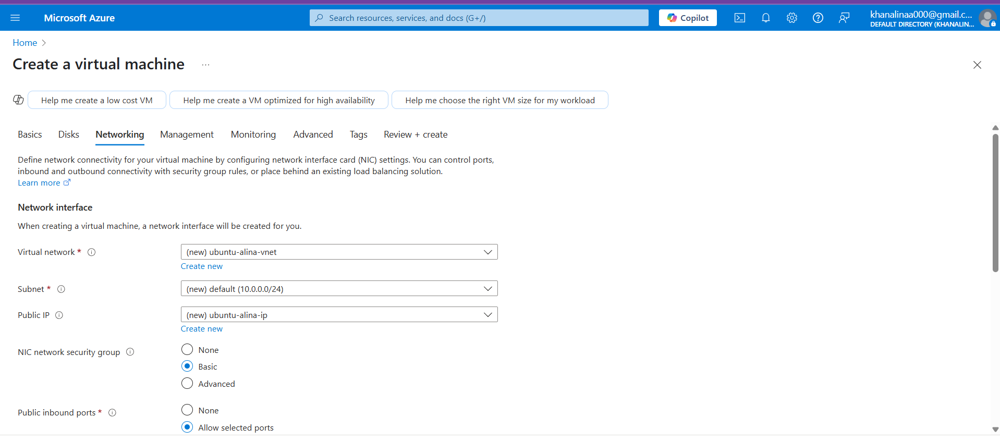

# Steps to Create and Access a Linux VM in Azure:

### 1️. Log in to Azure Portal  
Go to [https://portal.azure.com](https://portal.azure.com)

### 2️. Create Resource Group (if not exists)

### 3. Create a Virtual Network and Subnet

### 4. Create a Linux Virtual Machine
- Go to Create a Resource > Virtual Machine
- Choose:
  - VM Name: webvm1 (or any name)
  - Image: Ubuntu 20.04 LTS(or any Linux distro)
  - Size: Standard B1s
  - Authentication Type: SSH public key
  - Username: azureuser
  - Generate a new key pair or upload your own
  - Network: Select the VNet and Subnet created earlier
  - Inbound Ports: Allow SSH (Port 22)

### 5. Download SSH Private Key
- Save the .pem file securely if you generated a new key.

### 6. Connect the deployed VM through native SSH
- `ssh -i <path-to-your-key>.pem azureuser@<public-ip>`

### 7. Verify Connection
- Run basic commands like ls, uptime, or sudo apt update to test.

                                                              

# Steps to Create and Access a Windows VM in Azure:

### 1️. Log in to Azure Portal  
Go to [https://portal.azure.com](https://portal.azure.com)

### 2️. Use the above Resource Group (or create new)

### 3. Create a Virtual Network and Subnet

### 4. Create a Windows Virtual Machine
- Go to Create a Resource > Virtual Machine
- Choose:
  - VM Name: winvm1 (or any name)
  - Image: Windows Server 2019/2022
  - Size: Standard B1s or suitable size
  - Authentication Type: Password
  - Username: azureuser
  - Password: azureuser
  - Network: Select the VNet and Subnet created earlier
  - Inbound Ports: Allow RDP(Port 3389)

### 6. Connect to the Windows VM via Remote Desktop (RDP)
- Go to the Windows VM Overview page in Azure
- Click "Connect" > RDP
- Azure will generate an .rdp file — download it
- Open the .rdp file (double-click it)
- Enter your username and password when prompted
- Accept the certificate warning (if any) and continue

