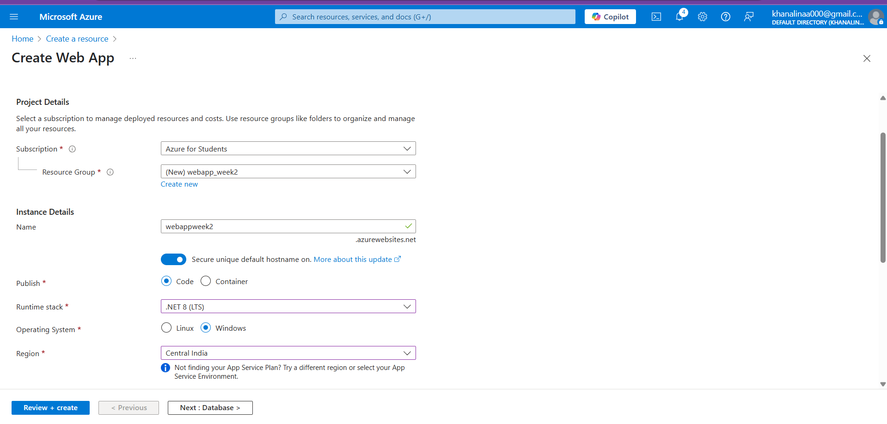
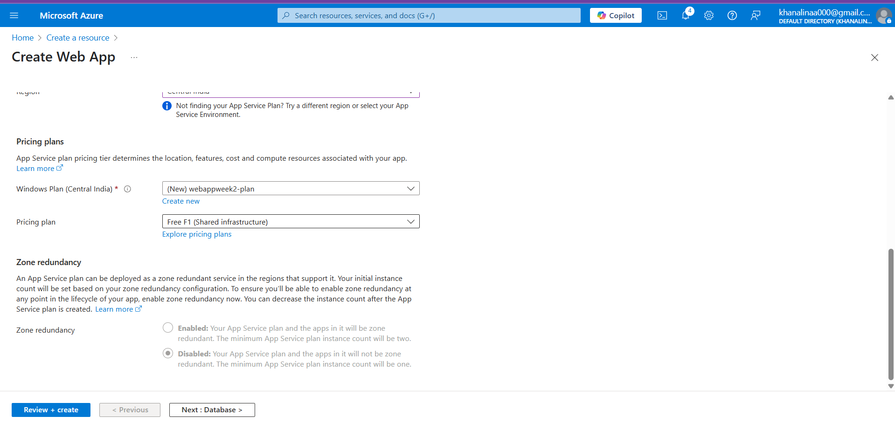
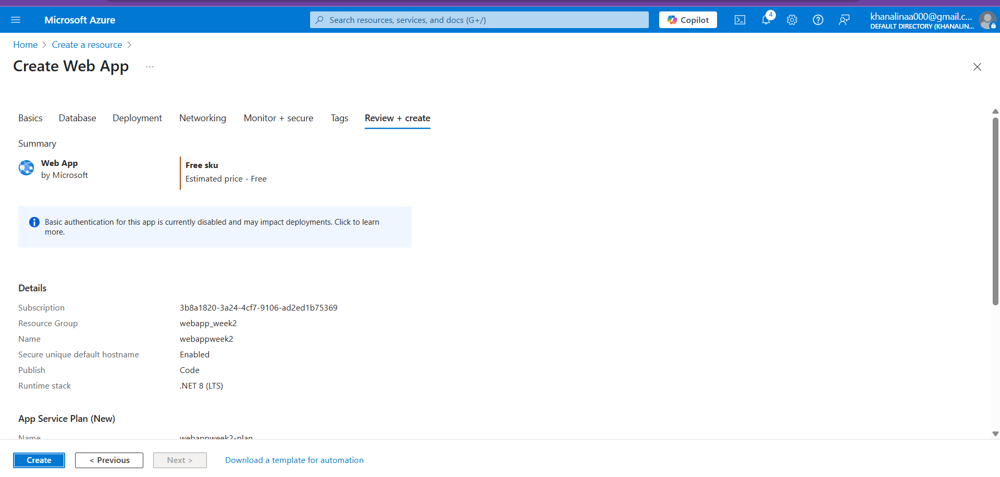
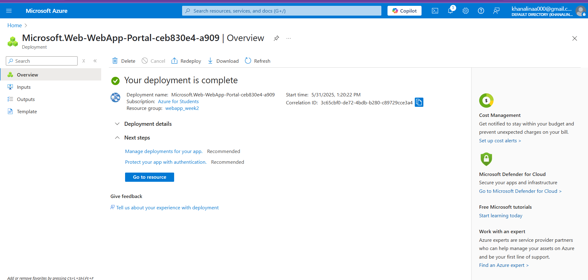
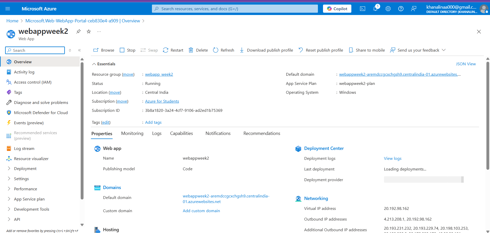
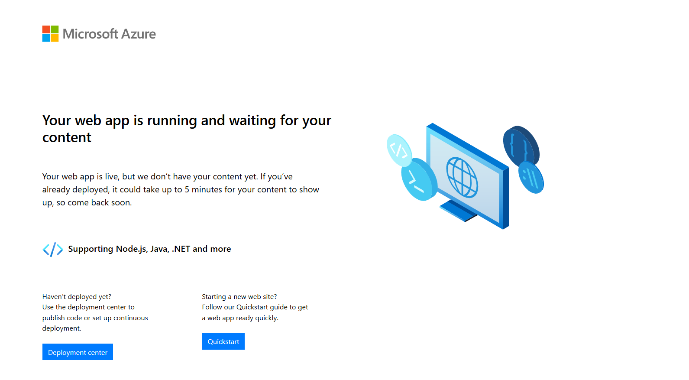
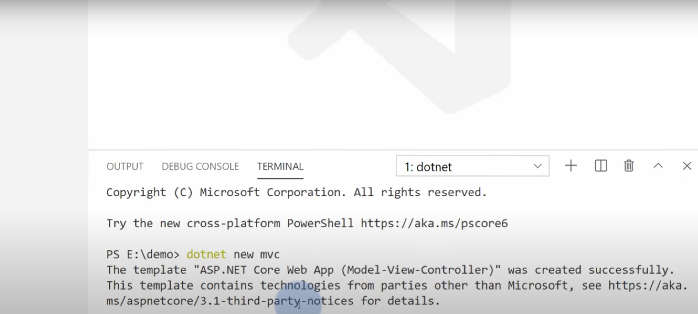
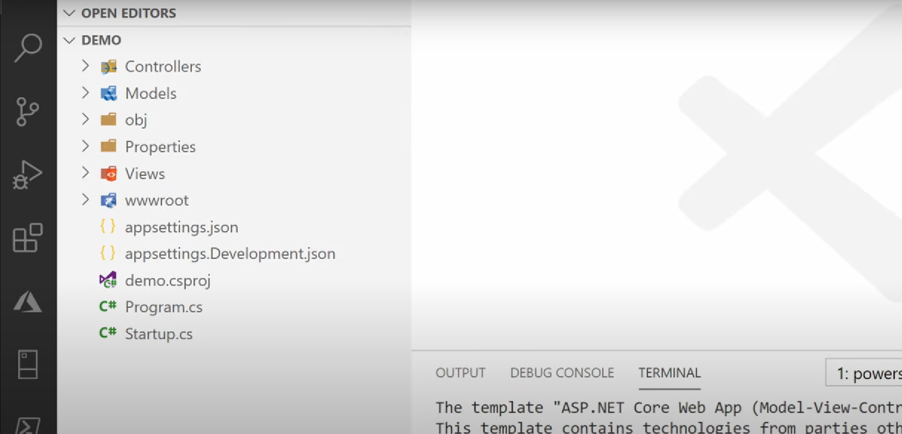
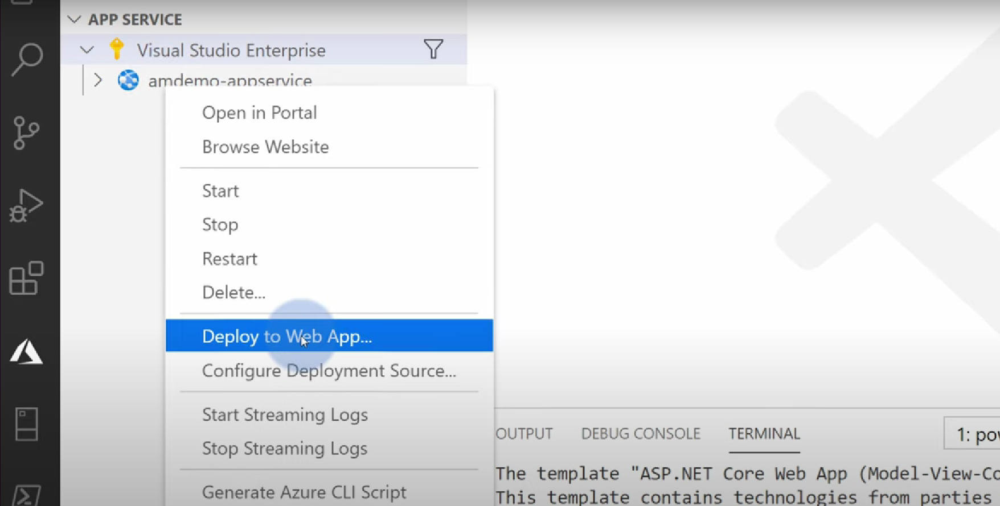
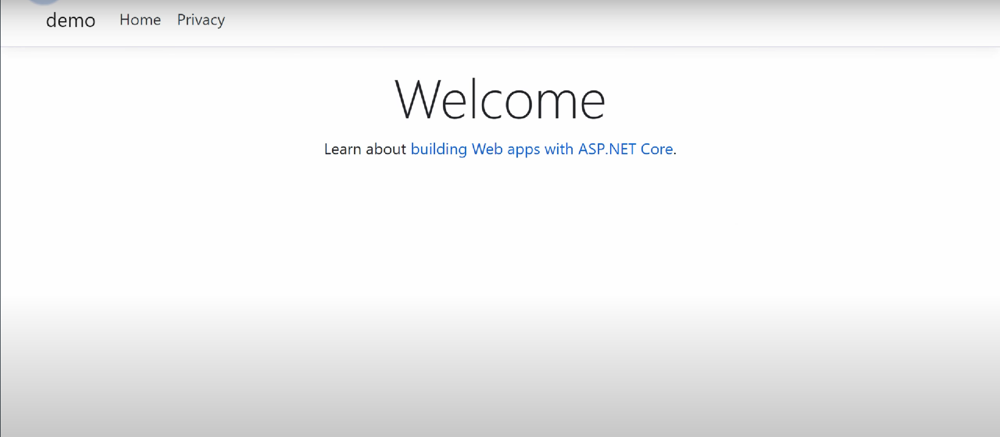

# **Task:** Deploy a Simple Web App to Azure App Service

## Steps Performed:
### 1.Created a Web App in Azure Portal

- Navigated to App Services in the Azure Portal.

- Clicked “Create” to provision a new Web App.

- Selected the appropriate subscription, resource group, and provided a unique name for the Web App.

- Selected a runtime stack (e.g., .NET) and chose a Free or Basic App Service Plan.

### 2.Access the Default Web App

- Once the Web App was created, visited the default URL provided by Azure:
`https://<your-app-name>.azurewebsites.net`

- Confirmed that the default Azure welcome page was loading successfully.

### 3.Created a .NET MVC Application Locally

- Opened Visual Studio Code.

- Ran the following command in the terminal:
   `dotnet new mvc -n MyWebApp`
- Opened the project and modified the Views/Home/Index.cshtml file to include a custom Welcome message.

### 4.Deployed the Application to Azure

- Used Azure CLI or deployment tools to publish the local app to the created Azure Web App.

- Verified the changes by refreshing the browser and confirming the custom welcome page was live.

## Outcome
Successfully deployed a custom .NET MVC application with a welcome page to Azure App Service, accessible via the assigned public URL.

