# **Task**: Create Azure Container Registry (ACR), Push Image, and Deploy Container

## Objective:
Set up a private Azure Container Registry, push a Docker image to it from the local environment, and deploy a container using that image.

## Steps Performed:
### 1.Created Azure Container Registry (ACR)

- Navigated to Container Registries in the Azure Portal.

- Clicked “Create” and configured:

  - Registry name (e.g., demoregistry)

  - Resource group

  - Location

  - SKU: Basic

- Deployed the registry.

### 2.Logged in to ACR from Local Terminal

`docker login demoregistry.azurecr.io`
- Used ACR username and password (found under Access keys in the Azure Portal).

### 3.Tagged the Local Docker Image

- Pulled a sample image from Docker Hub:

`docker pull hello-world`
- Tagged it for the ACR:

`docker tag hello-world demoregistry.azurecr.io/hello-world`

### 4.Pushed the Image to ACR

`docker push demoregistry.azurecr.io/hello-world`

### 5.Created a Container Instance Using ACR Image

- Went to Container Instances > Create.

- Selected:

  - Image source: Azure Container Registry

  - Image: hello-world

  - Other settings: name, region, resource group

- Deployed the container.

### 6.Verified the Deployment

- Checked logs from the container instance or accessed the public IP (if applicable) to ensure the container ran the image correctly.

## Outcome
Successfully pushed a Docker image to Azure Container Registry and deployed a container instance from that image.

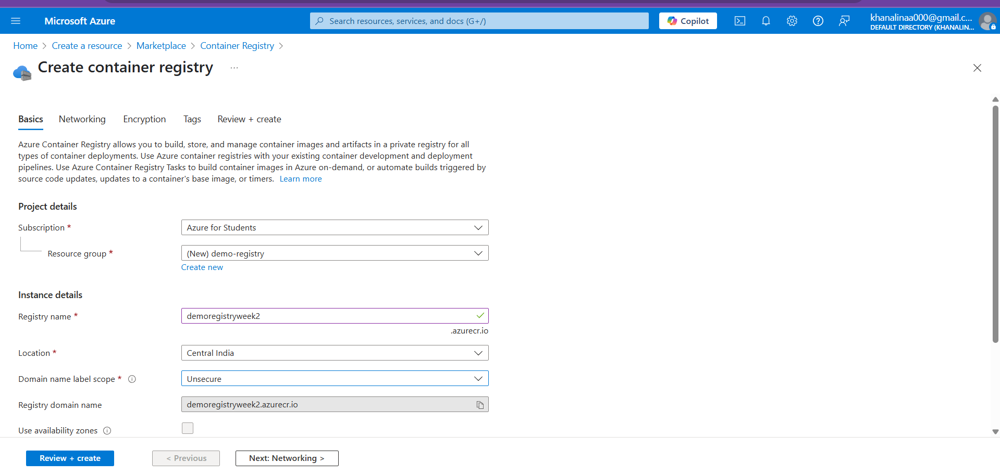
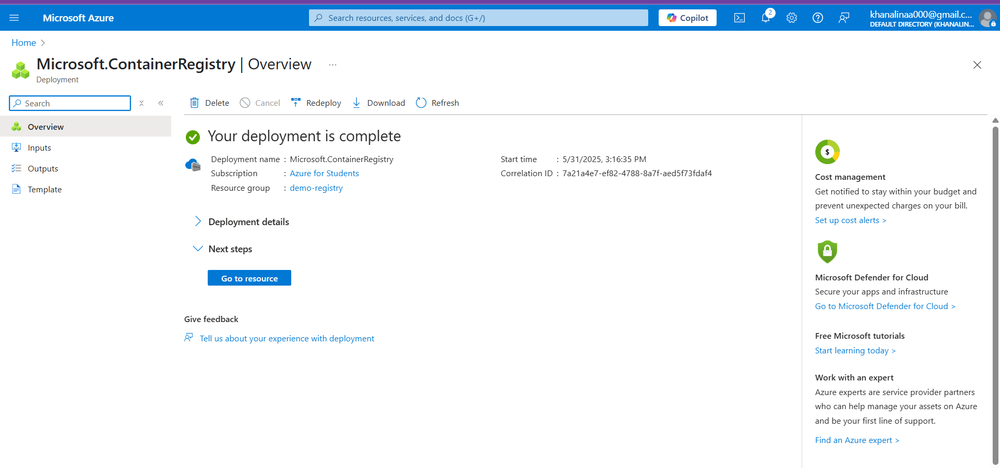
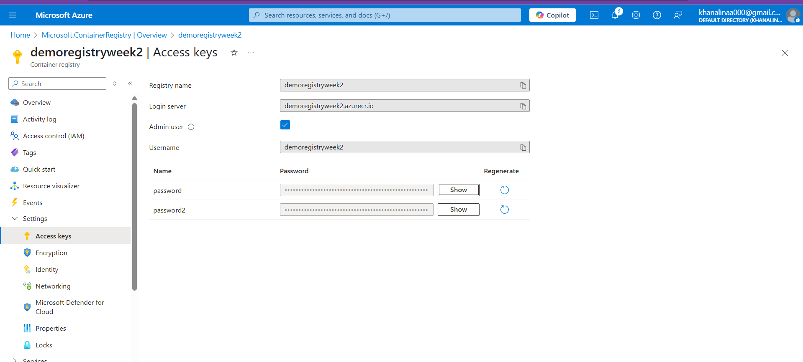
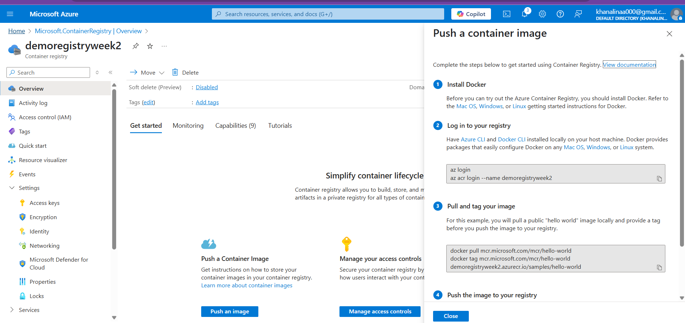
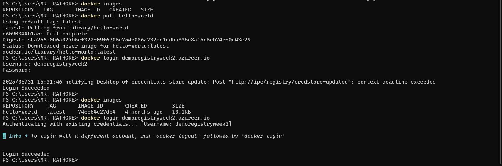
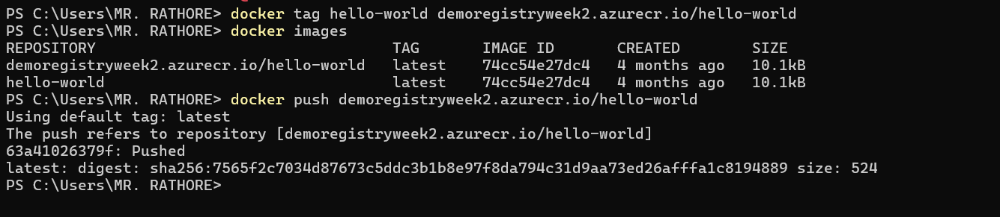
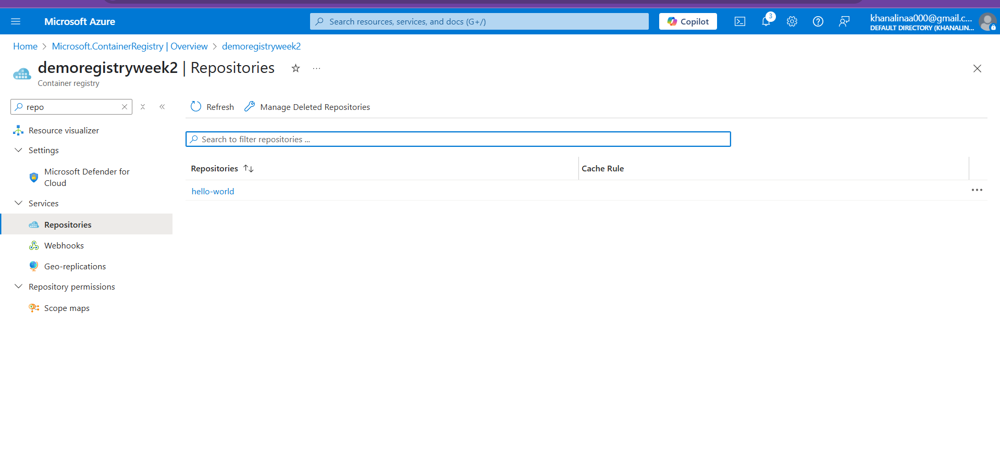
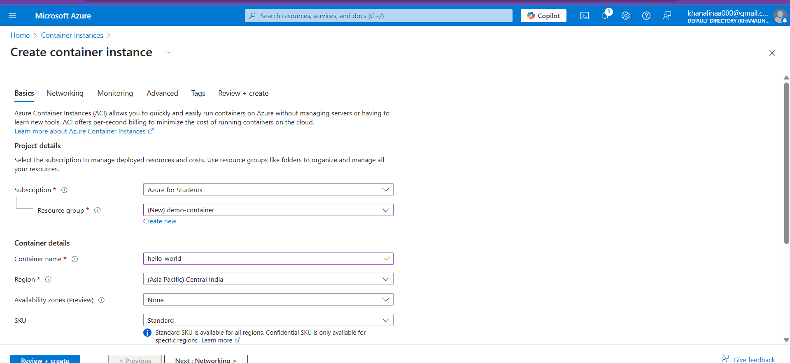
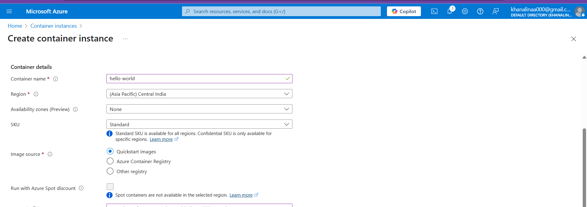
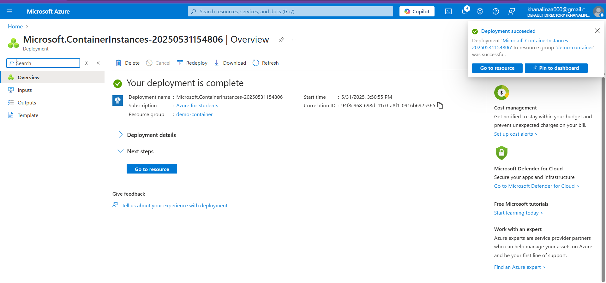
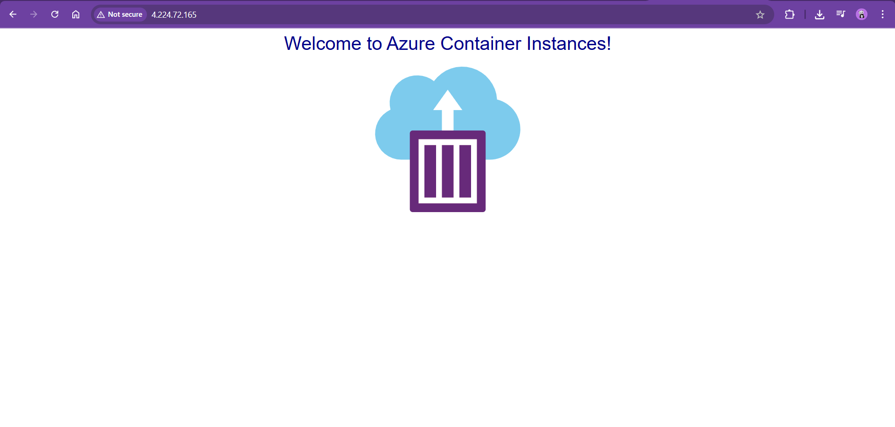