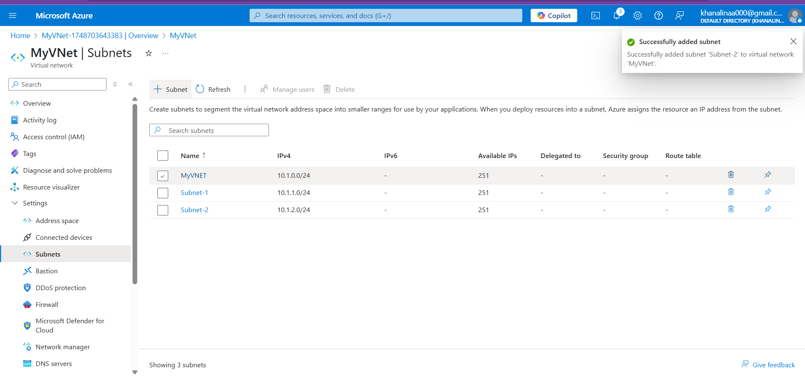
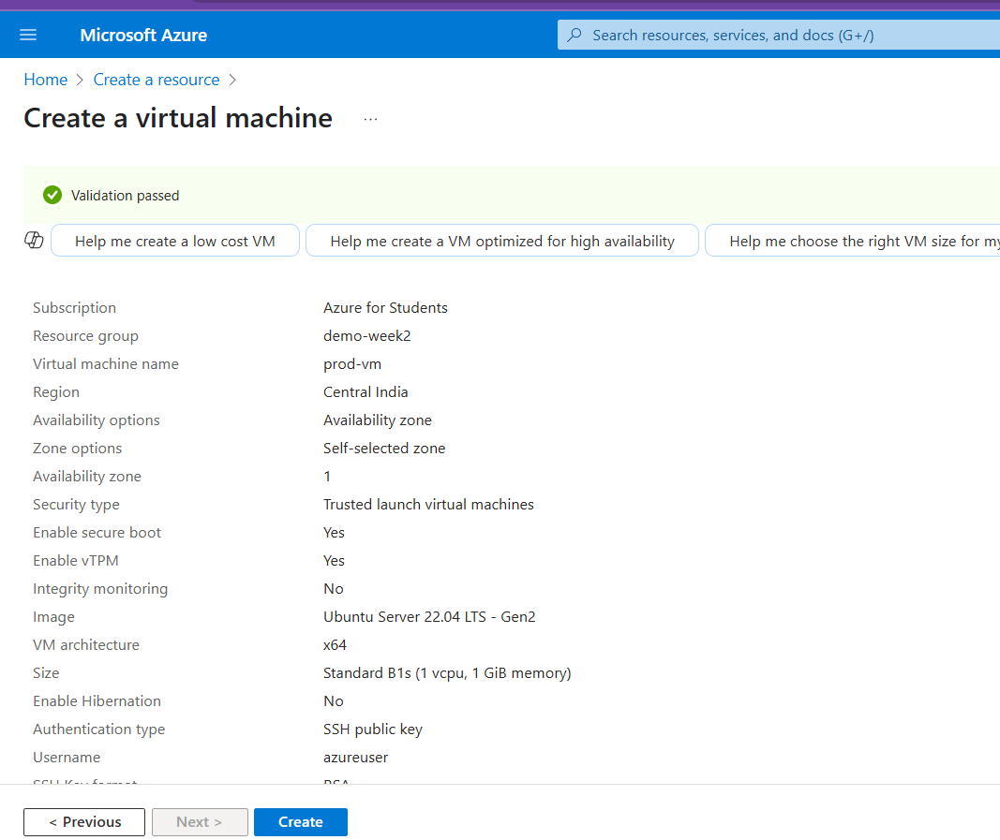
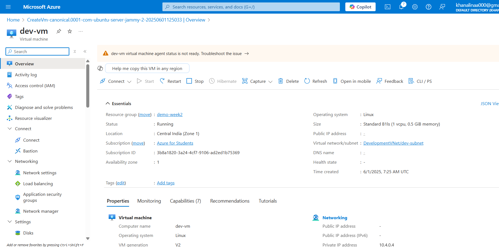

# **Task** : Network Segmentation & Hub-Spoke Architecture in Azure

# A. Virtual Network and Subnets (Basic Segmentation)
## Goal:
Create a single VNet with two subnets to host VMs and a SQL Server, with network-level isolation.

## Steps Followed:
### 1.Created Virtual Network

- Name: main-vnet

- Address space: 10.0.0.0/16

### 2.Created Subnets

- Subnet-1: 10.0.1.0/24 for Linux VM and Windows VM

- Subnet-2: 10.0.2.0/24 for SQL VM

### 3.Deployed VMs

- Linux VM and Windows VM in Subnet-1

- SQL VM in Subnet-2

### 4.Tested Internal Communication

- Verified ping from Linux and Windows VMs to SQL VM using private IPs

# B. Hub-and-Spoke Architecture (Multi-VNet Topology)

## Goal:
Implement a real-world multi-environment setup using VNet peering.

### 🔹 Step 1: Create the 4 VNets

| VNet Name        | Address Space | Subnet Name   | Subnet Range   |
|------------------|---------------|---------------|----------------|
| ManagementVNet   | 10.1.0.0/16   | mgmt-subnet   | 10.1.0.0/24    |
| ProductionVNet   | 10.2.0.0/16   | prod-subnet   | 10.2.0.0/24    |
| TestingVNet      | 10.3.0.0/16   | test-subnet   | 10.3.0.0/24    |
| DevelopmentVNet  | 10.4.0.0/16   | dev-subnet    | 10.4.0.0/24    |

- Create these via the Azure Portal (Virtual Network → +Create) or with Azure CLI if you prefer.

### 🔹 Step 2: Create One VM in Each VNet
- Use a basic Linux VM (Ubuntu) for each. Name them:

  - mgmt-vm in ManagementVNet

  - prod-vm in ProductionVNet

  - test-vm in TestingVNet

  - dev-vm in DevelopmentVNet

- When creating each VM, make sure to place them in the correct VNet + Subnet!

### 🔹 Step 3: Enable ICMP (Ping) in NSG for Each VM
- Repeat this for each VM:

- Go to VM > Networking > Network security group

- Add Inbound Rule:

  - Source: Any

  - Protocol: ICMP

  - Action: Allow

  - Priority: 100

  - Name: Allow-Ping

- Destination Port Ranges: (leave blank for ICMP)

This allows the VMs to respond to ping.

### 🔹 Step 4: Set Up VNet Peering (Hub-Spoke)
You will peer:

  - ManagementVNet ⇄ ProductionVNet

  - ManagementVNet ⇄ TestingVNet

  - ManagementVNet ⇄ DevelopmentVNet

VNet peering is bidirectional, so you’ll create a pair of peerings for each (one from each side).

Example: Peer ManagementVNet with ProductionVNet

1. Go to ManagementVNet > Peerings > +Add

  - Name: Mgmt-to-Prod

  - Peer VNet: ProductionVNet

  - Enable:

    - Allow forwarded traffic

    - Allow virtual network access

2. Now go to ProductionVNet > Peerings > +Add

  - Name: Prod-to-Mgmt

  - Peer VNet: ManagementVNet

  - Enable the same options

Repeat the above for Testing and Development VNets.

### 🔹 Step 5: SSH into the Management VM
Once peering and NSG rules are set, SSH into mgmt-vm using its public IP.

From the management VM terminal:

`ping <prod-vm-private-ip>`
`ping <test-vm-private-ip>`
`ping <dev-vm-private-ip>`

✅ If ping succeeds, your hub-and-spoke architecture is fully working.

