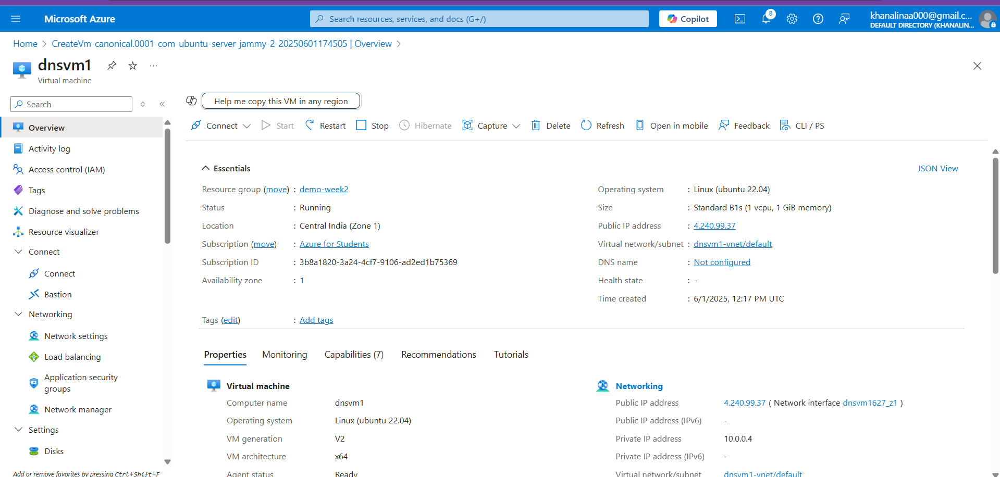
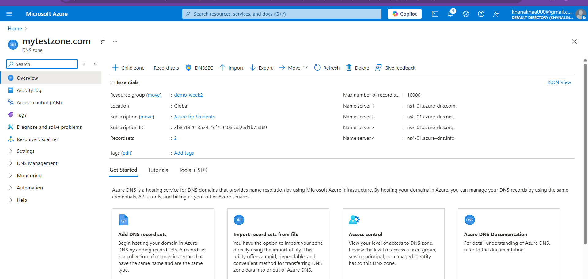
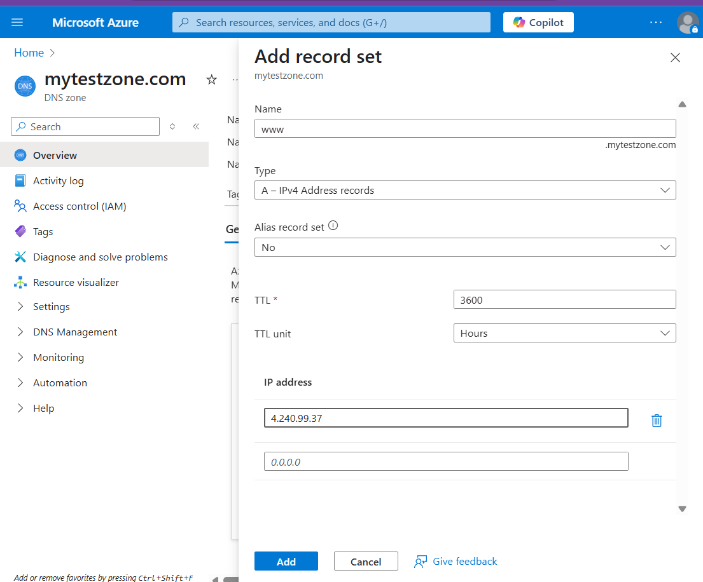
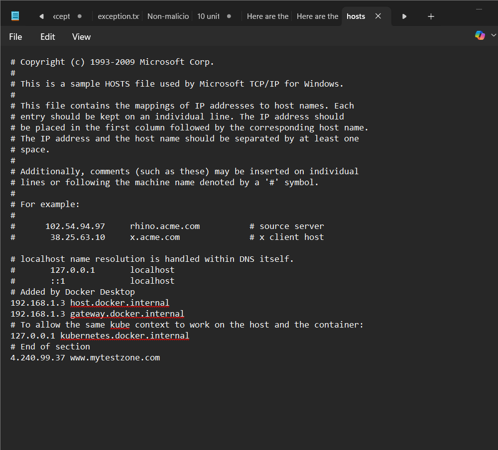

# **Task:** Set up a domain, setup a server on a VM and use the DNS server for traffic

## DNS Name Resolution Setup (Manual hosts File Method)
### 1. Set Up a Server VM:

- Created a VM (e.g., web server or test server) with IP 4.240.99.37.

### 2. Choose a Custom Domain Name:

- Chose a domain name www.mytestzone.com (no need to own it since you’re testing locally).

### 3. Edit the Local hosts File (on Windows Machine):

- Opened C:\Windows\System32\drivers\etc\hosts in Notepad with admin rights.

- Added the line:

   `4.240.99.37 www.mytestzone.com`

- This forces local name resolution for www.mytestzone.com to the given IP, bypassing any DNS lookup.

### 4. Test the Setup:

- Opened a browser or ran `ping www.mytestzone.com` to verify it resolves to 4.240.99.37.

## Important Notes:
- This approach is local-only: It does not use a DNS server, and other machines will not resolve the domain unless their hosts file is also modified.

- It’s useful for testing without registering a domain or setting up a DNS server.

