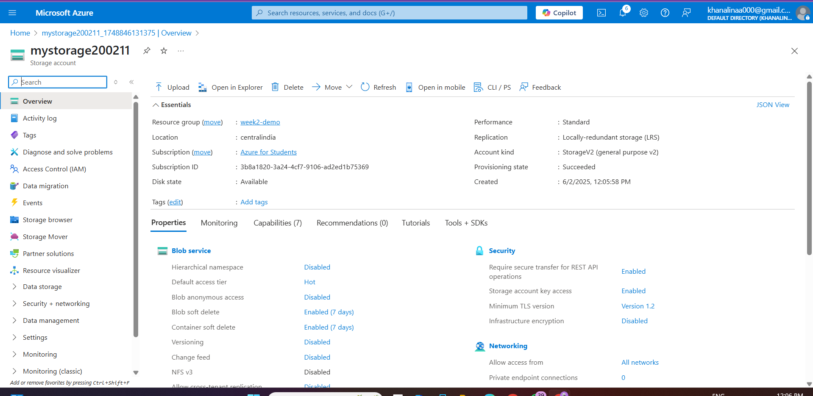

# **TASK** : Azure Storage Services: End-to-End Implementation and Exploration

## 🔵 1: Create a Storage Account
- Action: created a storage account named mystorage200211 using the Azure Portal.
- Config Details:

  - Performance: Standard

  - Redundancy: LRS (Locally Redundant Storage)

  - Primary service: Azure Blob Storage

- **Why it matters:** This is the core service to store blobs (files), configure access, and manage data lifecycle.

## 🔵 2: Create a Container & Upload a Blob
- Action:

  - Created a Blob container called mynewcontainer

  - Uploaded a blob named 12.png into it

- **Why it matters:** Containers organize blobs within the storage account; uploading blobs is the first functional use of the storage service.

## 🔵 3: Authentication Techniques – Tested Access Key Method
- Option Used: Access Keys

- Action:

  - Retrieved Access Key1 from Azure Portal

  - Used Azure CLI to list blobs with this key:

   <pre>
   az storage blob list \
     --account-name mystorage200211 \
     --container-name mynewcontainer \
     --account-key <access_key>
    </pre>

  - Output showed blob 12.png with metadata

- **Why it matters:** Access Keys are a fundamental way to securely access storage resources in scripts, tools, and SDKs.

## 🔵 4: Use Azure Storage Explorer
- Action:

  - Installed and opened Azure Storage Explorer

  - Chose to sign in using Azure account

  - Successfully accessed:

      - Storage account mystorage200211

      - Container mynewcontainer

      - Blob 12.png

- **Why it matters:** A GUI tool like Storage Explorer simplifies blob management, allowing upload, download, and config without CLI.

## 🔵 5: Create and Test Shared Access Signature (SAS)
- Action:

  - Generated a SAS token with Read permission

  - Created a SAS URL for blob 12.png

  - Tested the SAS URL in browser —  Image was successfully accessed

- **Why it matters:** SAS tokens let you share storage access securely with limited scope (time, permissions, specific resources).

## 🔵 6: Shared Access Signature (SAS)
- generated a SAS token for your blob storage.

- Allowed Read/List permissions with a specific start/end time.

- Used the SAS URL in a browser to successfully access a blob (12.png) without signing in.

- **Purpose:** Grant secure, time-bound access without sharing your account keys.

## 🔵 7: Access Tiers (Hot, Cool, Archive)
- Started with default Hot tier (frequent access).

- Changed tier to Cool manually (for infrequent access).

- Then changed to Archive (for long-term storage, least cost).

Understood:

🔥 Hot = quick access, higher storage cost.

❄️ Cool = cheaper storage, higher access cost.

📦 Archive = lowest storage cost, but needs hours to rehydrate.

- **Purpose:** Learn how Azure optimizes cost vs accessibility based on access patterns.

## 🔵 8: Lifecycle Management Policy
- Action: Created an automated policy to:

  - Move blobs to Cool after 1 day.

  - Move to Archive after 2 days.

  - (Optional) Delete after 3 days.

- Applied the policy to block blobs in your container.

- Noted that:

  - The policy won’t affect blobs already in Archive.

  - It acts on future uploads or blobs still in Hot/Cool.

- **Purpose:** Automate blob transitions to optimize storage lifecycle and reduce manual management.

## 🔵 9.1: Create Destination Storage Account
- Action:

  - Go to Azure Portal → Search Storage accounts → + Create.

  - Filled:

      - Name: deststorage200211 (globally unique)

      - Same subscription and resource group

      - Region: Can be same or different (e.g., East US if source is West US)

      - Performance: Standard

      - Redundancy: LRS is okay

  - Clicked Review + create → Create

## 9.2: Enable Object Replication
- Action:

  - Go to source storage account: mystorage200211

  - In the sidebar, go to Object replication → Click + Add rule

  - Configure the rule:

      - Destination account: Select deststorage200211

      - Source container: Select your container (e.g., mynewcontainer)

      - Destination container: Click Create new, name it replicatedcontainer

      - Click Next, then Review + Add

## 9.3: Test Replication
- Action:

  - Uploaded a new blob (e.g., a new image or text file) into mynewcontainer in mystorage200211.

  - Went to deststorage200211 → replicatedcontainer.

  - Within a few minutes, the blob appeared automatically in the destination container.

## 🔵 10: Azure File Share & Azure File Sync
## 10.1 Create Azure File Share
- Storage Account: mystorage200211

- Action: Created file share named myfileshare with 5 GB quota

- Purpose: Enables SMB file storage accessible via cloud or mapped drive

## 10.2 Map File Share to Windows (via PowerShell)
<pre>
net use Z: \\mystorage200211.file.core.windows.net\myfileshare /user:Azure\mystorage200211 <storage_key>
</pre>

- Result: File share accessible as drive Z: on Windows

- Use case: Upload/download files directly like local storage

## 10.3 Configure Azure File Sync
- Action:

  - Installed Azure File Sync Agent on Windows Server VM

- In Azure Portal:

   - Created Storage Sync Service

   - Created Sync Group

   - Registered Windows Server

   - Added Cloud Endpoint (myfileshare)

   - Added Server Endpoint (local folder on server)

- Result: Files between Azure file share and server folder now stay synchronized automatically.

- **Purpose:**
Provides hybrid storage with centralized cloud share and local server cache. Enhances performance, disaster recovery, and sync automation between on-prem and cloud.

